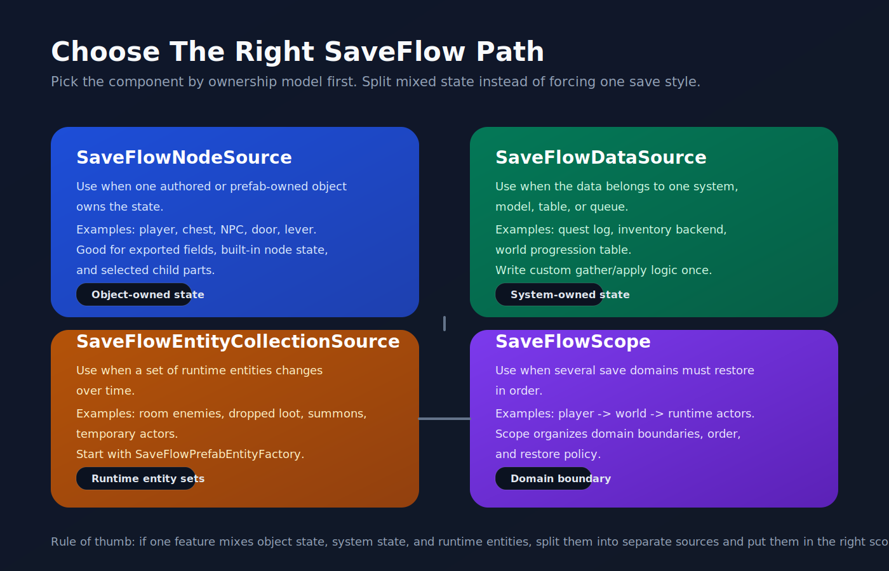
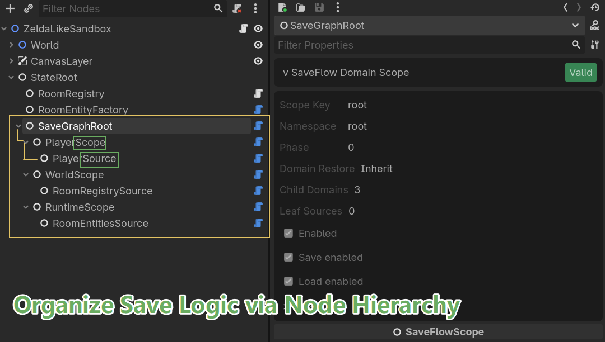

# SaveFlow Lite

SaveFlow Lite is a comfort-first save workflow plugin for Godot 4.

It is built for developers who do not just need to write save files, but need a cleaner way to organize save logic as projects grow.

## Status

- Godot: `4.6`
- Plugin version: `0.1.4`
- License: [MIT](LICENSE)
- Tests: runtime suite passing locally

## Plugin Preview



<p>
  
  
</p>

## At A Glance

Use SaveFlow Lite when your project looks like one of these:

| You Need To Save | Typical Example | Recommended Path |
| --- | --- | --- |
| One authored or prefab-owned object | `player`, `chest`, `NPC`, `door`, `lever` | `SaveFlowNodeSource` |
| One system, model, table, or queue | quest log, inventory backend, world progression table | custom `SaveFlowDataSource` |
| A changing set of runtime entities | room enemies, dropped loot, summoned units | `SaveFlowEntityCollectionSource` + `SaveFlowPrefabEntityFactory` |

If your save must restore several domains in order, add `SaveFlowScope` as a domain boundary and put the right leaf sources inside it.

## Install

1. Copy [`addons/saveflow_lite`](addons/saveflow_lite) into your project `addons/` folder.
2. Enable `SaveFlow Lite` in the Godot plugin settings.
3. Godot will register the `SaveFlow` autoload for you.

## Project Save Settings

`SaveFlow Lite` now adds a `SaveFlow Settings` dock in the editor.

Use it for project-wide defaults such as:
- save format
- save root and slot index path
- JSON and binary file extensions
- project title, game version, save schema, and data version
- safe write, auto-create directories, slot-index metadata, and log level

This panel configures the `SaveFlow` runtime singleton itself. It is the right
place for project-level defaults.

It is not the place for object-owned or system-owned save behavior. Keep those
decisions on:
- `SaveFlowNodeSource`
- `SaveFlowDataSource`
- `SaveFlowEntityCollectionSource`
- `SaveFlowScope`

## Start Here

- Quick component choice:
  [saveflow-quick-selection-map.md](docs/saveflow-quick-selection-map.md)
- Recommended integration path:
  [saveflow-recommended-integration.md](docs/saveflow-recommended-integration.md)
- Concept relationship map:
  [saveflow-concept-map.md](docs/saveflow-concept-map.md)
- Source tree map:
  [saveflow-source-map.md](docs/saveflow-source-map.md)
- Release notes:
  [CHANGELOG.md](CHANGELOG.md)

## Quick Use Cases

### Save one gameplay object

Use `SaveFlowNodeSource` when the mental model is "save this Godot object".

Examples:
- player state
- a chest that can be opened
- a door or lever with built-in node state
- an NPC with exported gameplay fields and an `AnimationPlayer`

### Save one game system

Use a custom `SaveFlowDataSource` when the state belongs to a system rather than one scene node.

Examples:
- quest log
- inventory model
- world progression table
- event queue

### Save runtime entities in one area

Use `SaveFlowEntityCollectionSource` when the set of entities changes over time.

Examples:
- current room enemies
- dropped loot
- summoned units
- temporary spawned world actors

Start with `SaveFlowPrefabEntityFactory` if one `type_key` maps cleanly to one prefab scene. Move to a custom `SaveFlowEntityFactory` only when you need pooling, authored spawn points, or custom lookup rules.

## Why SaveFlow Lite

Most save plugins help you serialize data.
SaveFlow Lite is aimed at an earlier pain point: structuring save/load code without ending up with glue-code spaghetti.

SaveFlow Lite focuses on:
- clean slot-based save/load APIs
- a scene and node workflow through `save_scene()` and `load_scene()`
- a hierarchical save graph workflow through `save_scope()` and `load_scope()`
- a node-centric workflow through `SaveFlowNodeSource` for built-in Godot node state
- exported-field persistence by default, instead of hand-written serializer glue
- system and table persistence through custom `SaveFlowDataSource`
- readable JSON in editor and binary output in exported builds
- lighter boilerplate for multi-system saves
- integration seams for runtime entity factories through `SaveFlowEntityCollectionSource`, `SaveFlowPrefabEntityFactory`, and `SaveFlowEntityFactory`
- a path that can grow into commercial project needs

## Current Lite Features

- `SaveFlow.save_data()` and `SaveFlow.load_data()` for direct payload saves
- `SaveFlow.save_scene()` and `SaveFlow.load_scene()` for scene/node workflows
- `SaveFlow.save_scope()` and `SaveFlow.load_scope()` for hierarchical save graphs
- `SaveFlow.inspect_scope()` for graph diagnostics
- `SaveFlow.save_nodes()` and `SaveFlow.load_nodes()` for custom saveable-node workflows
- `SaveFlowNodeSource` for target-node built-ins and selected child participants
- `SaveFlowDataSource` for manager, table, queue, and model-style state
- `SaveFlowEntityCollectionSource` and `SaveFlow.restore_entities()` as the runtime-entity seam
- `SaveFlowPrefabEntityFactory` as the default low-boilerplate runtime factory
- slot operations: save, load, delete, copy, rename, list
- slot metadata helpers
- safe-write pipeline with temp file replacement
- JSON in editor, binary in export through `AUTO` format
- demo sandbox scene
- GdUnit4 runtime tests

## Quick Start

Enable the `SaveFlow Lite` plugin in the Godot editor.
It registers an autoload named `SaveFlow`.

### Option 1: Save a plain dictionary

```gdscript
var game_data := {
    "player": {
        "hp": 100,
        "coins": 42,
    },
    "settings": {
        "language": "zh_CN",
    },
}

var save_result: SaveResult = SaveFlow.save_data(
    "slot_1",
    game_data,
    {
        "display_name": "Slot 1",
        "game_version": "0.1.0",
    }
)

if not save_result.ok:
    push_error(save_result.error_message)

var load_result: SaveResult = SaveFlow.load_data("slot_1")
if load_result.ok:
    var loaded_data: Dictionary = load_result.data
    print(loaded_data)
```

### Option 2: Save a scene through SaveFlowNodeSource

For the common path, you should not need to hand-write custom source classes for every gameplay node.

Instead, add a `SaveFlowNodeSource` as a child and mark the business fields you want persisted with `@export` or `@export_storage`.
SaveFlowNodeSource will persist exported fields by default, can include extra target properties, and can also include built-in transform/layout state plus selected child participants such as `AnimationPlayer`.

Example target node:

```gdscript
extends Node

@export var hp := 100
@export var coins := 42
var runtime_only_cache := {}
```

Then add a `SaveFlowNodeSource` under it and configure:
- `save_key = "player"`
- leave `property_selection_mode` at `Exported Fields + Additional Properties`
- use `additional_properties` only for extra target properties you want beyond exported fields
- use `ignored_properties` when a target property should not be saved
- optionally include child participants like `AnimationPlayer`

When the node source is selected in the editor, the Inspector now shows a compact SaveFlow panel so you can verify target fields, toggle built-ins, pick child participants, and catch missing paths before writing a slot.

Save and load the scene root:

```gdscript
var save_result: SaveResult = SaveFlow.save_scene(
    "slot_1",
    $StateRoot,
    {
        "display_name": "Slot 1",
        "game_version": "0.1.0",
    }
)

var load_result: SaveResult = SaveFlow.load_scene("slot_1", $StateRoot)
```

This is the main SaveFlow Lite workflow.
It is meant to reduce both:
- manual payload assembly
- repeated hand-written save/load glue on every stateful node
- separate "business fields" and "built-ins" save nodes for the same object

If you want full control, `save_nodes()` and `load_nodes()` support custom `SaveFlowSource` subclasses.

### Option 2.5: Save a node and selected built-in child parts

When the user mental model is "save this Godot object", the recommended path is now `SaveFlowNodeSource`.

Use it when:
- the target node has built-in Godot state that should be saved by type
- selected child nodes such as `AnimationPlayer` should travel with the same object
- you want less hand-written source code for common engine types

Example:

```text
Player
|- AnimationPlayer
|- SaveFlowNodeSource     # exported fields + built-ins + selected child participants
```

`SaveFlowNodeSource` binds to one target node and:
- gathers exported target fields by default
- gathers supported built-ins from the target type
- lets you include selected child relative paths such as `AnimationPlayer`
- stores a structured payload for the target and its included participants

When selected in the editor, `SaveFlowNodeSource` now shows an inspector panel that lets you:
- verify which target fields will be persisted
- toggle target built-ins on and off
- pick discovered child participants from the target subtree
- verify missing paths before saving

Current first-wave built-ins:
- `Node2D`
- `Node3D`
- `Control`
- `AnimationPlayer`
- `Timer`
- `AudioStreamPlayer` / `AudioStreamPlayer2D` / `AudioStreamPlayer3D`
- `PathFollow2D` / `PathFollow3D`
- `Camera2D` / `Camera3D`
- `Sprite2D` / `AnimatedSprite2D`
- `CharacterBody2D` / `CharacterBody3D`
- `RigidBody2D` / `RigidBody3D`
- `Area2D`
- `NavigationAgent2D`
- `TileMapLayer` / `TileMap` (cell payload)

You can also inspect what SaveFlow will collect before writing a slot:

```gdscript
var inspect_result: SaveResult = SaveFlow.inspect_scene($StateRoot)
if inspect_result.ok:
    print(inspect_result.data)
```

### Option 3: Save a hierarchical graph of systems

Once a project grows beyond a flat scene save, the main path should move to `SaveFlowScope` and `SaveFlowSource`.

- `SaveFlowScope` organizes a logical domain such as `player`, `world`, `settings`, or `spawned_enemies`
- `SaveFlowSource` is a leaf source inside that graph
- `SaveFlowNodeSource` already works as a `SaveFlowSource`, so you can reuse the same node-first workflow while changing how systems are organized

Treat `SaveFlowScope` as a domain boundary, not as a payload serializer.
It answers:
- which systems belong to one gameplay domain
- what order sibling domains should restore in
- how that domain should react to restore errors

It does not replace object ownership and it should not be used as a generic
"container that saves things by itself".

Example graph:

```text
SaveGraphRoot
|- PlayerScope
|  |- PlayerCoreSource
|  |- PartyScope
|     |- AriaSource
|     |- BramSource
|- WorldScope
|  |- WorldStateSource
|  |- QuestStateSource
|  |- EnemyScope
|     |- WolfAlphaSource
|     |- SlimeBetaSource
|- SettingsScope
   |- SettingsStateSource
```

Save and load the graph root:

```gdscript
var save_result: SaveResult = SaveFlow.save_scope(
    "slot_1",
    $StateRoot/SaveGraphRoot,
    {
        "display_name": "Slot 1",
        "game_version": "0.2.0",
    }
)

var load_result: SaveResult = SaveFlow.load_scope(
    "slot_1",
    $StateRoot/SaveGraphRoot,
    true
)
```

Use this path when:
- one gameplay domain spans multiple nodes
- restore order matters
- you want an explicit save hierarchy instead of one flat `save_key` namespace
- runtime entities should eventually be delegated into an entity-factory-driven runtime workflow

You can inspect the graph before saving:

```gdscript
var inspect_result: SaveResult = SaveFlow.inspect_scope($StateRoot/SaveGraphRoot)
if inspect_result.ok:
    print(inspect_result.data)
```

For runtime entities, SaveFlow should orchestrate and your game systems should create the entities.
The recommended seam is now:
- `SaveFlowEntityCollectionSource` for the runtime set
- `SaveFlowPrefabEntityFactory` when one `type_key` maps directly to one prefab scene
- `SaveFlowEntityFactory` when the project already owns pooling, authored spawning, or custom lookup logic

That keeps the save graph explicit in the scene while still letting the project own runtime spawning.

`SaveFlowEntityCollectionSource` now exposes three restore policies:
- `Apply Existing`
  Only update entities the factory can already find.
- `Create Missing`
  Update existing entities and spawn missing ones through the factory. This is the default.
- `Clear And Restore`
  Clear the target container first, then rebuild the saved set through the factory.

`failure_policy` controls failure behavior:
- `Report Only`: SaveFlow restores what it can and reports the failures in the result
- `Fail On Missing Or Invalid`: the load fails if any entity is missing or cannot be restored

### Option 4: Save non-node system state through SaveFlowDataSource

Not every commercial save problem lives on scene nodes.
Some state belongs to:
- quest managers
- inventory backends
- region tables
- event queues
- profile registries

That is what `SaveFlowDataSource` is for.

The recommended path is a custom `SaveFlowDataSource`.

Recommended scene workflow:

```gdscript
# world_data_source.gd
extends SaveFlowDataSource

@export_node_path("Node") var world_state_path: NodePath

func gather_data() -> Dictionary:
    var world_state := get_node_or_null(world_state_path)
    if world_state == null:
        return {}
    return Dictionary(world_state.system_state).duplicate(true)

func apply_data(data: Dictionary) -> void:
    var world_state := get_node_or_null(world_state_path)
    if world_state == null:
        return
    world_state.system_state = data.duplicate(true)
```

`SaveFlowDataSource` can also provide editor preview metadata through
`describe_data_plan()`.

That preview uses a fixed top-level schema:
- `valid`
- `reason`
- `source_key`
- `data_version`
- `phase`
- `enabled`
- `save_enabled`
- `load_enabled`
- `summary`
- `sections`
- `details`

Only those top-level fields are rendered by the built-in preview.
If you want custom preview content, put it inside `details` instead of adding
new top-level keys.

Then wire it into the graph like any other source:

```text
SaveGraphRoot
|- WorldScope
   |- WorldDataSource
```

This is the preferred path when the state is:
- not naturally represented by exported node fields
- owned by a manager or service
- stored in a dictionary, table, queue, or registry

The main path is a custom `SaveFlowDataSource`.
Separate adapter-node patterns are possible, but they are no longer the recommended starting point.

## Demo

Open:
- `res://demo/saveflow_lite/plugin_sandbox/plugin_sandbox.tscn`
- `res://demo/saveflow_lite/complex_sandbox/complex_sandbox.tscn`

The sandbox demonstrates:
- mutate local state
- save into a slot
- load the slot back
- list slots
- delete the slot
- node-source-driven persistence using exported fields

The complex sandbox demonstrates:
- a `SaveScope` graph over player, world, settings, party, and enemy domains
- how a larger save hierarchy can stay readable
- the current limitation around missing runtime entities
- why entity collections need an entity factory integration seam

Related files:
- [plugin_sandbox.tscn](demo/saveflow_lite/plugin_sandbox/plugin_sandbox.tscn)
- [plugin_sandbox.gd](demo/saveflow_lite/plugin_sandbox/plugin_sandbox.gd)
- [sandbox_player.gd](demo/saveflow_lite/plugin_sandbox/sandbox_player.gd)
- [sandbox_settings.gd](demo/saveflow_lite/plugin_sandbox/sandbox_settings.gd)

## Testing

Import the project headlessly:

```powershell
.\tools\import_project.ps1
```

Run runtime tests:

```powershell
.\tools\run_gdunit.ps1 -ContinueOnFailure
```

Current runtime coverage includes:
- JSON save/load
- binary save/load
- slot copy/rename/delete
- source collection and restore
- node-source-driven scene save/load
- scene inspection and exported-field collection
- hierarchical save graph gather/apply
- strict graph failure when a source target disappears
- data-source graph save/load
- entity collection restoration delegation

## C# Direction

C# is part of the product direction, but the first-class wrapper layer is not implemented yet.

The intended shape is:
- `SaveFlow.SaveData(...)`
- `SaveFlow.LoadData(...)`
- `SaveFlow.SaveNodes(...)`
- `SaveFlow.LoadNodes(...)`

The goal is not just "call the GDScript autoload from C#".
The goal is a wrapper that feels idiomatic for Godot C# users and supports stronger typing over time.

## Lite vs Pro Direction

SaveFlow Lite should solve:
- clean save architecture for jam and lightweight projects
- slot handling without boilerplate
- practical node/system save workflow
- explicit save graphs for multi-system authored state
- manager and table state through a first-class data-source path

SaveFlow Pro should solve:
- migration workflow
- richer debugging and inspection
- stronger commercial-project safety
- advanced recovery, async, encryption, and long-lived project ergonomics
- runtime entity sync policies and more complete world reconstruction

## Project Status

Current status:
- brand renamed to `SaveFlow Lite`
- main runtime entry is `SaveFlow`
- demo scene is working
- runtime tests are passing
- C# wrapper layer is planned, not shipped
