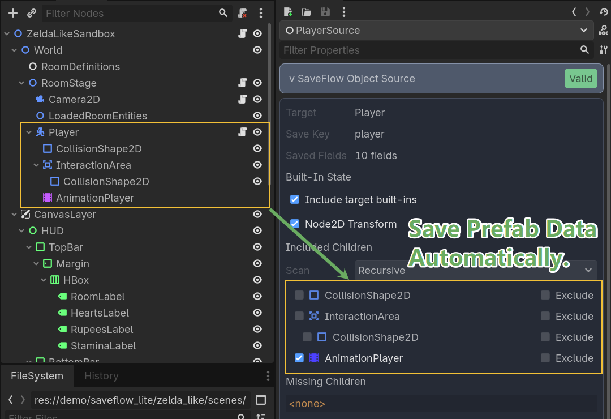

# SaveFlow Lite

SaveFlow Lite is a comfort-first save workflow plugin for Godot 4.

It is built for developers who do not just need to write save files, but need a cleaner way to organize save logic as projects grow.

## Status

- Godot: `4.6`
- Plugin version: `0.9.1`
- Documentation: [SaveFlow Lite Docs](https://zoroiscrying.github.io/saveflow-lite/)
- License: [MIT](LICENSE)
- Tests: runtime suite passing locally

## Plugin Preview


<p>
  
  
</p>

## Start With One Ownership Model

Start with the smallest ownership model that matches what you are saving:

| You Need To Save | Typical Example | Recommended Path |
| --- | --- | --- |
| One authored or prefab-owned object | `player`, `chest`, `NPC`, `door`, `lever` | `SaveFlowNodeSource` |
| One system, model, table, or queue | quest log, inventory backend, world progression table | `SaveFlowTypedDataSource` or custom `SaveFlowDataSource` |
| A changing set of runtime entities | room enemies, dropped loot, summoned units | `SaveFlowEntityCollectionSource` + `SaveFlowPrefabEntityFactory` |

If your save must restore several domains in order, add `SaveFlowScope` as a domain boundary and put the right leaf sources inside it.

## Install

For a normal project, install only the addon folders:

1. Download `saveflow-lite-vX.Y.Z-addons.zip` from the latest release, or install the plugin from the Godot Asset Library.
2. Extract or copy [`addons/saveflow_core`](addons/saveflow_core) and [`addons/saveflow_lite`](addons/saveflow_lite) into your project `addons/` folder.
3. Enable `SaveFlow Lite` in `Project > Project Settings > Plugins`.
4. Godot will register the `SaveFlow` autoload for you.

Use `saveflow-lite-vX.Y.Z-addons-demo.zip` only when you want a runnable demo project with the recommended template and example scenes included.

Release package shapes are intentionally narrow:

| Package | Intended use | Archive root |
| --- | --- | --- |
| Godot Asset Library / `saveflow-lite-vX.Y.Z-addons.zip` | Install into an existing game project. | `addons/` only. |
| `saveflow-lite-vX.Y.Z-addons-demo.zip` | Open the demo project directly or study example scenes. | `addons/`, `demo/`, `project.godot`, and this README. |
| GitHub repository clone | Inspect docs source, release automation, or public history. | Full source mirror, including `docs-site`. |

Do not copy `docs-site`, `tmp`, `.github`, `tests`, or release tooling into a
game project. Those paths are for the public repository and automation, not the
runtime addon package.

## Project Save Settings

`SaveFlow Lite` now adds a `SaveFlow Settings` dock in the editor.

Use it for project-wide defaults such as:
- save format
- save root and slot index path
- JSON and binary file extensions
- project title, game version, save schema, and data version
- safe write, last-known-good backup, auto-create directories, slot-index metadata, and log level
- compatibility enforcement for `save_schema`, `data_version`, and scene/scope restore targets

This panel configures the `SaveFlow` runtime singleton itself. It is the right
place for project-level defaults.

It is not the place for object-owned or system-owned save behavior. Keep those
decisions on:
- `SaveFlowNodeSource`
- `SaveFlowTypedDataSource` / `SaveFlowDataSource`
- `SaveFlowEntityCollectionSource`
- `SaveFlowScope`

`SaveFlow Lite` also includes `DevSaveManager` for editor-side slot inspection.
Read its badges in this order:
- `Compatibility`: can the slot load under the current schema/data-version policy?
- `Restore Contract`: is the current scene the expected restore target?
- `Slot Safety`: is the primary file healthy, and is backup recovery available?

If you need more than the headline state, expand `Slot Details` to inspect the
slot path, primary file state, backup state, schema, versions, and saved scene path.

The 2D/3D editor menu also shows a small `SaveFlow` validator badge. Use it to
preflight the current scene for obvious authoring mistakes such as duplicate
source keys, invalid Source/Scope/Factory plans, and misplaced pipeline signal
bridges before running the game.

## Start Here

- Start with one object:
  `SaveFlowNodeSource`
- Start with one system:
  `SaveFlowTypedDataSource` if exported typed fields are enough, custom `SaveFlowDataSource` if gather/apply logic is project-specific
- Start with one runtime set:
  `SaveFlowEntityCollectionSource` + `SaveFlowPrefabEntityFactory`
- Quick component choice:
  [saveflow-quick-selection-map.md](addons/saveflow_lite/docs/saveflow-quick-selection-map.md)
- Recommended integration path:
  [saveflow-recommended-integration.md](addons/saveflow_lite/docs/saveflow-recommended-integration.md)
- Public docs site source:
  [docs-site/README.md](docs-site/README.md)
- Recommended template:
  `res://demo/saveflow_lite/recommended_template/scenes/project_workflow/recommended_project_workflow_main.tscn`
- Pipeline signals demo:
  `res://demo/saveflow_lite/recommended_template/scenes/pipeline_notifications/pipeline_notification_demo.tscn`
- Common authoring mistakes:
  [saveflow-common-authoring-mistakes.md](addons/saveflow_lite/docs/saveflow-common-authoring-mistakes.md)
- Commercial-project guide:
  [saveflow-commercial-project-guide.md](addons/saveflow_lite/docs/saveflow-commercial-project-guide.md)
- Concept relationship map:
  [saveflow-concept-map.md](addons/saveflow_lite/docs/saveflow-concept-map.md)
- Source tree map:
  [saveflow-source-map.md](addons/saveflow_lite/docs/saveflow-source-map.md)
- C# quickstart:
  [saveflow-csharp-quickstart.md](addons/saveflow_lite/docs/saveflow-csharp-quickstart.md)
- Release notes:
  [CHANGELOG.md](CHANGELOG.md)

## Quick Use Cases

### Save one gameplay object

Use `SaveFlowNodeSource` when the mental model is "save this Godot object".

Examples:
- player state
- a chest that can be opened
- a door or lever with built-in node state
- an NPC with exported gameplay fields and an `AnimationPlayer`

### Save one game system

Use `SaveFlowTypedDataSource` when the state belongs to a typed data object
rather than one scene node.

Examples:
- quest log
- inventory model
- world progression table
- event queue

Use a custom `SaveFlowDataSource` when the source itself must translate tables,
registries, caches, or external manager state during gather/apply.

### Save runtime entities in one area

Use `SaveFlowEntityCollectionSource` when the set of entities changes over time.

Examples:
- current room enemies
- dropped loot
- summoned units
- temporary spawned world actors

Start with `SaveFlowPrefabEntityFactory` if one `type_key` maps cleanly to one prefab scene. Move to a custom `SaveFlowEntityFactory` only when you need pooling, authored spawn points, or custom lookup rules.

## Why SaveFlow Lite

Most save plugins help you serialize data.
SaveFlow Lite is aimed at an earlier pain point: structuring save/load code without ending up with glue-code spaghetti.

SaveFlow Lite focuses on:
- clean slot-based save/load APIs
- a scene and node workflow through `save_scene()` and `load_scene()`
- a hierarchical save graph workflow through `save_scope()` and `load_scope()`
- a node-centric workflow through `SaveFlowNodeSource` for built-in Godot node state
- exported-field persistence by default, instead of hand-written serializer glue
- system and table persistence through typed data resources or custom `SaveFlowDataSource`
- readable JSON in editor and binary output in exported builds
- lighter boilerplate for multi-system saves
- integration seams for runtime entity factories through `SaveFlowEntityCollectionSource`, `SaveFlowPrefabEntityFactory`, and `SaveFlowEntityFactory`
- a path that can grow into commercial project needs

## Current Lite Features

- `SaveFlow.save_data()` and `SaveFlow.load_data()` for direct payload saves
- `SaveFlow.read_slot_summary()`, `SaveFlow.read_slot_metadata()`, and `SaveFlow.list_slot_summaries()` for lightweight save-list UI reads
- `SaveFlow.save_scene()` and `SaveFlow.load_scene()` for scene/node workflows
- `SaveFlow.save_scope()` and `SaveFlow.load_scope()` for hierarchical save graphs
- `SaveFlow.inspect_scope()` for graph diagnostics
- `SaveFlowPipelineControl`, `SaveFlowPipelineSignals`, callback/signal events, and `pipeline_trace` metadata for local save/load lifecycle control
- `SaveFlow.save_nodes()` and `SaveFlow.load_nodes()` for custom saveable-node workflows
- `SaveFlowNodeSource` for target-node built-ins and selected child participants
- `SaveFlowTypedData` and `SaveFlowTypedDataSource` for typed manager/model-style state
- `SaveFlowDataSource` for custom manager, table, queue, and registry adapters
- `SaveFlowEntityCollectionSource` and `SaveFlow.restore_entities()` as the runtime-entity seam
- `SaveFlowPrefabEntityFactory` as the default low-boilerplate runtime factory
- slot operations: save, load, delete, copy, rename, list
- typed slot metadata helpers through `SaveFlowSlotMetadata`
- active-slot and save-card UI helpers through `SaveFlowSlotWorkflow` and `SaveFlowSlotCard`
- safe-write pipeline with temp file replacement
- optional last-known-good slot backup beside each slot file
- compatibility inspection and baseline load blocking for schema/data-version mismatches
- scene/scope restore target verification through saved scene-path metadata
- JSON in editor, binary in export through `AUTO` format
- demo sandbox scene
- GdUnit4 runtime tests

## Quick Start

Enable the `SaveFlow Lite` plugin in the Godot editor.
It registers an autoload named `SaveFlow`.

### Option 1: Save a plain dictionary

```gdscript
var game_data := {
    "player": {
        "hp": 100,
        "coins": 42,
    },
    "settings": {
        "language": "zh_CN",
    },
}

var save_result: SaveResult = SaveFlow.save_data(
    "slot_1",
    game_data,
    "Slot 1",
    "manual"
)

if not save_result.ok:
    push_error(save_result.error_message)

var load_result: SaveResult = SaveFlow.load_data("slot_1")
if load_result.ok:
    var loaded_data: Dictionary = load_result.data
    print(loaded_data)
```

### Option 1.5: Build a load menu from slot summaries

When game UI only needs save-list rows, read slot summaries instead of loading
full gameplay payload:

```gdscript
var summaries_result: SaveResult = SaveFlow.list_slot_summaries()
if summaries_result.ok:
    for summary in summaries_result.data:
        print(
            "%s | %s | %s" % [
                summary["display_name"],
                summary["save_type"],
                summary["location_name"],
            ]
        )
```

Each summary keeps the common save-list fields at the top level:

- `display_name`
- `save_type`
- `chapter_name`
- `location_name`
- `playtime_seconds`
- `difficulty`
- `thumbnail_path`

and exposes `compatibility_report` plus `custom_metadata` for project-specific
UI needs.

Keep the three slot identity concepts separate:

- `slot_index`: integer UI/session identity for sorting and active-slot state
- `slot_id`: stable SaveFlow storage key such as `slot_1`
- `display_name`: player-facing metadata such as `Forest Gate`

Recommended save-card rule:

- the game owns `active_slot_index`
- SaveFlow writes exactly one `slot_id` per save request
- manual save, autosave, and checkpoint events write the active card unless the
  game intentionally selected a different slot
- `display_name` is metadata for the row/card UI, not the storage key

Use `SaveFlowSlotWorkflow` when your game follows the common pattern of
integer slot selection plus stable storage keys:

```gdscript
const SlotWorkflowScript := preload("res://addons/saveflow_core/runtime/types/saveflow_slot_workflow.gd")

var slot_workflow: Resource = SlotWorkflowScript.new()

func _ready() -> void:
	slot_workflow.slot_id_template = "slot_{index}"
	slot_workflow.empty_display_name_template = "Manual Slot {index}"
	slot_workflow.select_slot_index(1)

func manual_save(slot_index: int) -> void:
	slot_workflow.select_slot_index(slot_index)
	var meta: SaveFlowSlotMetadata = slot_workflow.build_active_slot_metadata(
		"Manual Slot %d" % slot_index,
		"manual",
		"Chapter 1",
		current_location_name(),
		current_playtime_seconds()
	)
	SaveFlow.save_data(slot_workflow.active_slot_id(), build_payload(), meta)

func build_save_cards() -> Array:
	var summaries := SaveFlow.list_slot_summaries()
	if not summaries.ok:
		return []
	return slot_workflow.build_cards_for_indices(PackedInt32Array([1, 2, 3]), summaries.data)
```

`SaveFlowSlotWorkflow` does not save automatically and does not own your
session. It only centralizes active slot index, storage-key mapping, metadata
construction, and save-card summary data.

To keep save-list metadata consistent, start from typed slot metadata. Extend
`SaveFlowSlotMetadata` when your project needs more save-list fields:

```gdscript
# my_slot_metadata.gd
class_name MySlotMetadata
extends SaveFlowSlotMetadata

@export var slot_index := 0
@export var storage_key := ""

# Save call
func save_game(game_data: Dictionary) -> void:
	var meta := MySlotMetadata.new()
	meta.display_name = "Forest Gate"
	meta.save_type = "autosave"
	meta.chapter_name = "Chapter 2"
	meta.location_name = "Forest Gate"
	meta.playtime_seconds = 1320
	meta.slot_index = 1
	meta.storage_key = "slot_1"

	SaveFlow.save_data("slot_1", game_data, meta)
```

If several save-list fields belong together, group them in a nested
`SaveFlowTypedData` object instead of hand-writing a dictionary:

```gdscript
class_name MySlotRowData
extends SaveFlowTypedData

@export var slot_index := 0
@export var storage_key := ""
@export var tags: PackedStringArray = PackedStringArray()

class_name MyGroupedSlotMetadata
extends SaveFlowSlotMetadata

@export var row_data := MySlotRowData.new()
```

SaveFlow still writes metadata as a dictionary on disk, but gameplay code should
prefer typed fields and inherited metadata classes over string-key dictionaries.
If metadata contains runtime objects, raw Resources, or too many custom fields,
SaveFlow emits an authoring warning. Keep metadata focused on save-list summary
UI; move real gameplay state into the save payload or SaveFlow sources.

### Option 2: Save a scene through SaveFlowNodeSource

For the common path, you should not need to hand-write custom source classes for every gameplay node.

Instead, add a `SaveFlowNodeSource` as a child and mark the business fields you want persisted with `@export` or `@export_storage`.
SaveFlowNodeSource will persist exported fields by default, can include extra target properties, and can also include built-in transform/layout state plus selected child participants such as `AnimationPlayer`.

Example target node:

```gdscript
extends Node

@export var hp := 100
@export var coins := 42
var runtime_only_cache := {}
```

Then add a `SaveFlowNodeSource` under it and configure:
- `save_key = "player"`
- leave `property_selection_mode` at `Exported Fields + Additional Properties`
- use `additional_properties` only for extra target properties you want beyond exported fields
- use `ignored_properties` when a target property should not be saved
- optionally include child participants like `AnimationPlayer`

When the node source is selected in the editor, the Inspector now shows a compact SaveFlow panel so you can verify target fields, toggle built-ins, pick child participants, and catch missing paths before writing a slot.

Save and load the scene root:

```gdscript
var save_result: SaveResult = SaveFlow.save_scene(
    "slot_1",
    $StateRoot,
    "Slot 1"
)

var load_result: SaveResult = SaveFlow.load_scene("slot_1", $StateRoot)
```

This is the main SaveFlow Lite workflow.
It is meant to reduce both:
- manual payload assembly
- repeated hand-written save/load glue on every stateful node
- separate "business fields" and "built-ins" save nodes for the same object

If you want full control, `save_nodes()` and `load_nodes()` support custom `SaveFlowSource` subclasses.

### Option 2.5: Save a node and selected built-in child parts

When the user mental model is "save this Godot object", the recommended path is now `SaveFlowNodeSource`.

Use it when:
- the target node has built-in Godot state that should be saved by type
- selected child nodes such as `AnimationPlayer` should travel with the same object
- you want less hand-written source code for common engine types

Example:

```text
Player
|- AnimationPlayer
|- SaveFlowNodeSource     # exported fields + built-ins + selected child participants
```

`SaveFlowNodeSource` binds to one target node and:
- gathers exported target fields by default
- gathers supported built-ins from the target type
- lets you include selected child relative paths such as `AnimationPlayer`
- stores a structured payload for the target and its included participants

When selected in the editor, `SaveFlowNodeSource` now shows an inspector panel that lets you:
- verify which target fields will be persisted
- toggle target built-ins on and off
- pick discovered child participants from the target subtree
- verify missing paths before saving

Current first-wave built-ins:
- `Node2D`
- `Node3D`
- `Control`
- `AnimationPlayer`
- `Timer`
- `AudioStreamPlayer` / `AudioStreamPlayer2D` / `AudioStreamPlayer3D`
- `PathFollow2D` / `PathFollow3D`
- `Camera2D` / `Camera3D`
- `Sprite2D` / `AnimatedSprite2D`
- `CharacterBody2D` / `CharacterBody3D`
- `RigidBody2D` / `RigidBody3D`
- `Area2D`
- `NavigationAgent2D`
- `TileMapLayer` / `TileMap` (cell payload)

You can also inspect what SaveFlow will collect before writing a slot:

```gdscript
var inspect_result: SaveResult = SaveFlow.inspect_scene($StateRoot)
if inspect_result.ok:
    print(inspect_result.data)
```

### Option 3: Save a hierarchical graph of systems

Once a project grows beyond a flat scene save, the main path should move to `SaveFlowScope` and `SaveFlowSource`.

- `SaveFlowScope` organizes a logical domain such as `player`, `world`, `settings`, or `spawned_enemies`
- `SaveFlowSource` is a leaf source inside that graph
- `SaveFlowNodeSource` already works as a `SaveFlowSource`, so you can reuse the same node-first workflow while changing how systems are organized

Treat `SaveFlowScope` as a domain boundary, not as a payload serializer.
It answers:
- which systems belong to one gameplay domain
- what order sibling domains should restore in
- how that domain should react to restore errors

It does not replace object ownership and it should not be used as a generic
"container that saves things by itself".

Example graph:

```text
SaveGraphRoot
|- PlayerScope
|  |- PlayerCoreSource
|  |- PartyScope
|     |- AriaSource
|     |- BramSource
|- WorldScope
|  |- WorldStateSource
|  |- QuestStateSource
|  |- EnemyScope
|     |- WolfAlphaSource
|     |- SlimeBetaSource
|- SettingsScope
   |- SettingsStateSource
```

Save and load the graph root:

```gdscript
var save_result: SaveResult = SaveFlow.save_scope(
    "slot_1",
    $StateRoot/SaveGraphRoot,
    "Slot 1"
)

var load_result: SaveResult = SaveFlow.load_scope(
    "slot_1",
    $StateRoot/SaveGraphRoot,
    true
)
```

Use this path when:
- one gameplay domain spans multiple nodes
- restore order matters
- you want an explicit save hierarchy instead of one flat `save_key` namespace
- runtime entities should eventually be delegated into an entity-factory-driven runtime workflow

You can inspect the graph before saving:

```gdscript
var inspect_result: SaveResult = SaveFlow.inspect_scope($StateRoot/SaveGraphRoot)
if inspect_result.ok:
    print(inspect_result.data)
```

For runtime entities, SaveFlow should orchestrate and your game systems should create the entities.
The recommended seam is now:
- `SaveFlowEntityCollectionSource` for the runtime set
- `SaveFlowPrefabEntityFactory` when one `type_key` maps directly to one prefab scene
- `SaveFlowEntityFactory` when the project already owns pooling, authored spawning, or custom lookup logic

That keeps the save graph explicit in the scene while still letting the project own runtime spawning.

Custom factories receive the saved descriptor as the stable wire-format
dictionary, but factory code should immediately convert it to
`SaveFlowEntityDescriptor` so it does not depend on handwritten string keys:

```gdscript
extends SaveFlowEntityFactory

func can_handle_type(type_key: String) -> bool:
    return type_key == "enemy"

func spawn_entity_from_save(descriptor: Dictionary, _context: Dictionary = {}) -> Node:
    var entity_descriptor := resolve_entity_descriptor(descriptor)
    var enemy := EnemyScene.instantiate()
    enemy.name = entity_descriptor.persistent_id
    return enemy

func apply_saved_data(node: Node, payload: Variant, _context: Dictionary = {}) -> void:
    node.apply_runtime_payload(payload)
```

`SaveFlowEntityCollectionSource` now exposes three restore policies:
- `Apply Existing`
  Only update entities the factory can already find.
- `Create Missing`
  Update existing entities and spawn missing ones through the factory. This is the default.
- `Clear And Restore`
  Clear the target container first, then rebuild the saved set through the factory.

`failure_policy` controls failure behavior:
- `Report Only`: SaveFlow restores what it can and reports the failures in the result
- `Fail On Missing Or Invalid`: the load fails if any entity is missing or cannot be restored

Entity descriptors have a fixed core shape: `persistent_id`, `type_key`, and
`payload`. Use `SaveFlowIdentity.descriptor_extra` only for small spawn/routing
data the factory needs before payload application, such as a spawn point or pool
id. Normal gameplay state still belongs in the entity payload.

```gdscript
$Enemy/Identity.descriptor_extra = {
	"spawn_point": "north_gate",
	"pool_id": "forest_enemies",
}
```

For local lifecycle control, pass a `SaveFlowPipelineControl` to scope save/load.
The control owns callbacks; its `context.values` dictionary is still passed to
existing scope/source hooks.

```gdscript
var control := SaveFlowPipelineControl.new()
control.context.values["restore_reason"] = "continue_latest"

control.before_load = func(event: SaveFlowPipelineEvent) -> void:
	print("Load slot: ", event.slot_id)

control.before_apply_source = func(event: SaveFlowPipelineEvent) -> void:
	if event.key == "inventory" and not _inventory_ready():
		event.cancel("Inventory is not ready.")

control.after_load = func(_event: SaveFlowPipelineEvent) -> void:
	_refresh_hud()

var result := SaveFlow.load_scope("slot_1", $SaveGraphRoot, true, control)
if result.ok:
	print(result.meta["pipeline_trace"])
```

This trace reports local scope/source stages such as `scope.before_load`,
`source.apply`, and `scope.after_load`, plus callback stages such as
`before_apply_source`. It is not a scene/resource scheduler.

If the reaction belongs in a scene rather than the caller script, add a
`SaveFlowPipelineSignals` node under a `SaveFlowScope` or `SaveFlowSource` and
connect its signals in Godot's Node > Signals panel. The signal bridge is a
pipeline helper, so it is not written into the save payload and is ignored by
NodeSource child-participant collection.

### Option 4: Save non-node system state through typed data

Not every commercial save problem lives on scene nodes.
Some state belongs to:
- quest managers
- inventory backends
- region tables
- event queues
- profile registries

That is what `SaveFlowTypedDataSource` is for.

The recommended first path is `SaveFlowTypedData`, a typed Resource convenience
base. Gameplay code edits fields; SaveFlow converts those fields to the normal
Variant/Dictionary payload at the graph boundary.

Recommended data object:

```gdscript
# world_state_data.gd
class_name WorldStateData
extends SaveFlowTypedData

@export var chapter := 1
@export var unlocked_regions: PackedStringArray = []
@export var quest_flags := {}
```

Recommended scene workflow:

```text
WorldState
|- SaveFlowTypedDataSource
```

Prefer assigning the `SaveFlowTypedData` resource directly to
`SaveFlowTypedDataSource` when the scene owns that data.

The source itself is contract-based, not Resource-only. It accepts any object
that implements:

```gdscript
func to_saveflow_payload() -> Dictionary
func apply_saveflow_payload(payload: Dictionary) -> void
```

That means a target `Node`, a target property holding `RefCounted` data, or a
custom `Resource` can be used without extending `SaveFlowTypedData`. Use this
when gameplay code creates or swaps the data at runtime.

Use a custom `SaveFlowDataSource` only when the source itself needs bespoke
translation logic or your project already owns a dictionary/table payload:

```gdscript
extends SaveFlowDataSource

func gather_data() -> Dictionary:
    return export_payload_from_my_registry()

func apply_data(data: Dictionary) -> void:
    import_payload_into_my_registry(data)
```

`SaveFlowTypedDataSource` and custom `SaveFlowDataSource` can both provide
editor preview metadata through `describe_data_plan()`.

That preview uses a fixed top-level schema:
- `valid`
- `reason`
- `source_key`
- `data_version`
- `phase`
- `enabled`
- `save_enabled`
- `load_enabled`
- `summary`
- `sections`
- `details`

Only those top-level fields are rendered by the built-in preview.
If you want custom preview content, put it inside `details` instead of adding
new top-level keys.

Then wire it into the graph like any other source:

```text
SaveGraphRoot
|- WorldScope
   |- WorldDataSource
```

This is the preferred path when the state is:
- not naturally represented by exported node fields
- owned by a manager or service
- stored in typed data, a table, queue, or registry

Start with `SaveFlowTypedDataSource` when one object can provide a coherent
payload through the payload-provider contract. Move to a custom
`SaveFlowDataSource` when the source itself needs broader adapter logic rather
than just field persistence.

## Demo

Start with:
- `res://demo/saveflow_lite/recommended_template/scenes/project_workflow/recommended_project_workflow_main.tscn`
- `res://demo/saveflow_lite/recommended_template/scenes/pipeline_notifications/pipeline_notification_demo.tscn`
- `res://demo/saveflow_lite/recommended_template/scenes/csharp_workflow/csharp_workflow_demo.tscn`

Use the older sandboxes as QA and historical references:
- `res://demo/saveflow_lite/plugin_sandbox/plugin_sandbox.tscn`
- `res://demo/saveflow_lite/complex_sandbox/complex_sandbox.tscn`
- `res://demo/saveflow_lite/zelda_like/scenes/zelda_like_sandbox.tscn`

The recommended project workflow demonstrates:
- a project-style hub scene and authored room subscenes
- active slot selection with manual save/load/delete
- autosave and checkpoint writes
- typed room data, player node state, and runtime entity collections
- scene-authored UI that reads save state instead of owning gameplay data

The focused public demos demonstrate:
- pipeline signals for source-level and final save/load feedback
- the C# path through `SaveFlowTypedStateSource`, `SaveFlowSlotWorkflow`, `SaveFlowSlotCard`, and `SaveFlowClient.SaveScope()`

The plugin sandbox demonstrates:
- mutate local state
- save into a slot
- load the slot back
- list slots
- delete the slot
- node-source-driven persistence using exported fields

The complex sandbox demonstrates:
- a `SaveScope` graph over player, world, settings, party, and enemy domains
- how a larger save hierarchy can stay readable
- how one explicit `SaveGraphRoot` can own the save graph without duplicate Source children on target nodes
- the current limitation around missing runtime entities
- why entity collections need an entity factory integration seam

Related files:
- [plugin_sandbox.tscn](demo/saveflow_lite/plugin_sandbox/plugin_sandbox.tscn)
- [plugin_sandbox.gd](demo/saveflow_lite/plugin_sandbox/plugin_sandbox.gd)
- [sandbox_player.gd](demo/saveflow_lite/plugin_sandbox/sandbox_player.gd)
- [sandbox_settings.gd](demo/saveflow_lite/plugin_sandbox/sandbox_settings.gd)

## Testing

Import the project headlessly:

```powershell
.\tools\import_project.ps1
```

Run runtime tests:

```powershell
.\tools\run_gdunit.ps1 -ContinueOnFailure
```

Current runtime coverage includes:
- JSON save/load
- binary save/load
- slot copy/rename/delete
- source collection and restore
- node-source-driven scene save/load
- scene inspection and exported-field collection
- hierarchical save graph gather/apply
- strict graph failure when a source target disappears
- data-source graph save/load
- entity collection restoration delegation

## C# Direction

C# now has a shipped baseline wrapper layer in:
- `addons/saveflow_core/runtime/dotnet/client/SaveFlowClient.cs`
- `addons/saveflow_core/runtime/dotnet/client/SaveFlowCallResult.cs`
- `addons/saveflow_core/runtime/dotnet/slots/SaveFlowSlotMetadata.cs`
- `addons/saveflow_core/runtime/dotnet/entities/SaveFlowEntityDescriptor.cs`

Current entrypoints include:
- `SaveFlowClient.SaveData(...)`
- `SaveFlowClient.LoadData(...)`
- `SaveFlowClient.SaveNodes(...)`
- `SaveFlowClient.LoadNodes(...)`
- `SaveFlowClient.SaveScope(...)`
- `SaveFlowClient.LoadScope(...)`
- `SaveFlowClient.SaveCurrent(...)`
- `SaveFlowClient.LoadCurrent(...)`
- `SaveFlowClient.InspectSlotCompatibility(...)`
- `SaveFlowClient.SaveDevNamedEntry(...)`
- `SaveFlowClient.LoadDevNamedEntry(...)`

In C#, use `SaveFlow.DotNet.SaveFlowClient` for these calls.

The goal is not just "call the GDScript autoload from C#".
The goal is a wrapper that feels idiomatic for Godot C# users and supports stronger typing over time.

## Lite vs Pro Direction

SaveFlow Lite should solve:
- clean save architecture for jam and lightweight projects
- slot handling without boilerplate
- practical node/system save workflow
- explicit save graphs for multi-system authored state
- manager and table state through a first-class data-source path
- baseline trust features such as scene-restore contracts, version compatibility reporting, and last-backup safety

SaveFlow Pro should solve:
- migration and version tooling
- multi-scene restore orchestration and resource-loading coordination
- storage profiles, cold-backup recovery helpers, and cloud-save transport
- reference repair across authored/runtime objects
- seamless/background save workflows for larger commercial projects

For a deeper explanation of why those problems appear and how they map back to Godot workflows, see:
- [saveflow-commercial-project-guide.md](addons/saveflow_lite/docs/saveflow-commercial-project-guide.md)

## Project Status

Current status:
- brand renamed to `SaveFlow Lite`
- main runtime entry is `SaveFlow`
- demo scene is working
- runtime tests are passing
- C# wrapper baseline is shipped in `saveflow_core/runtime/dotnet`
